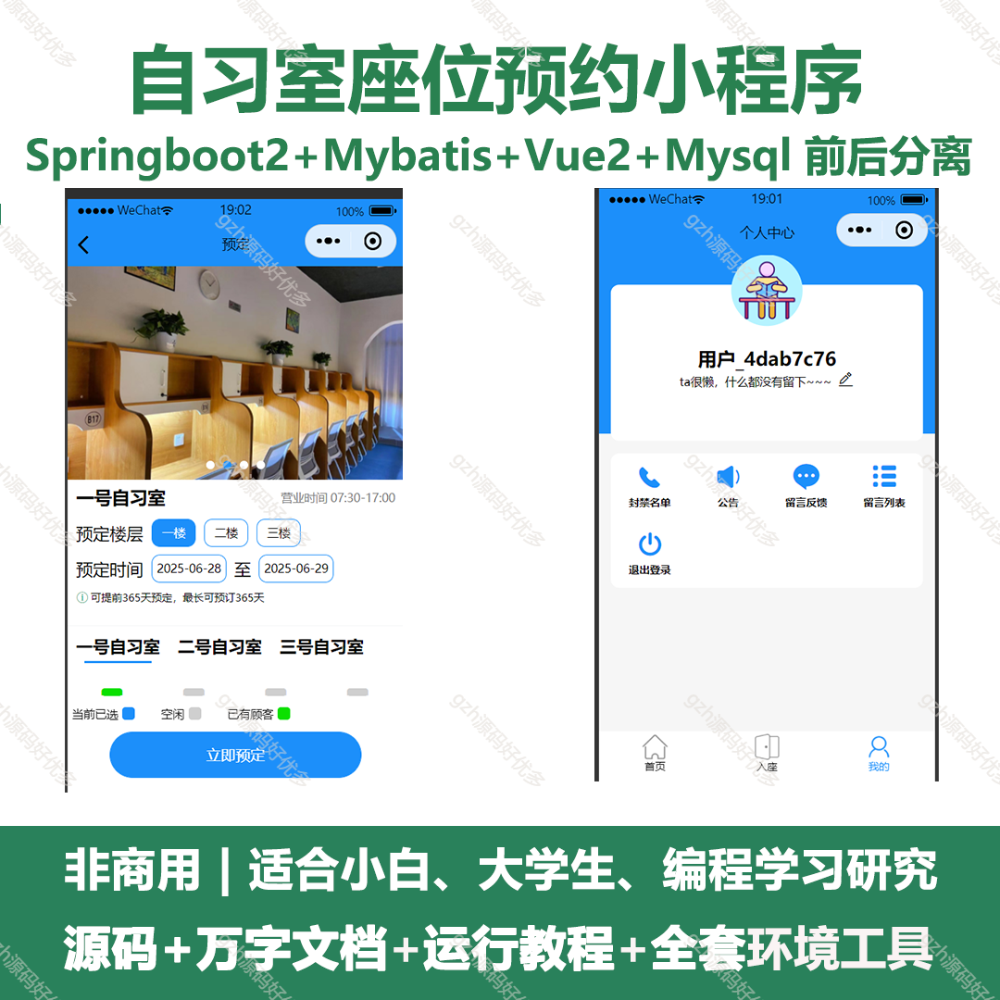
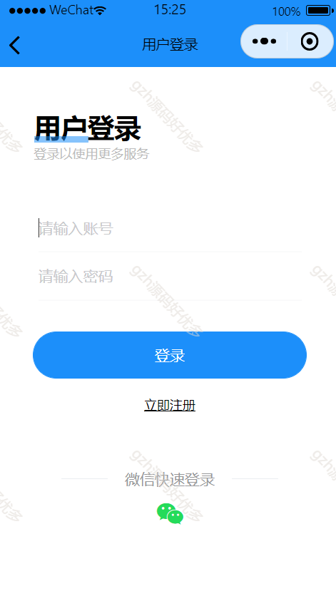
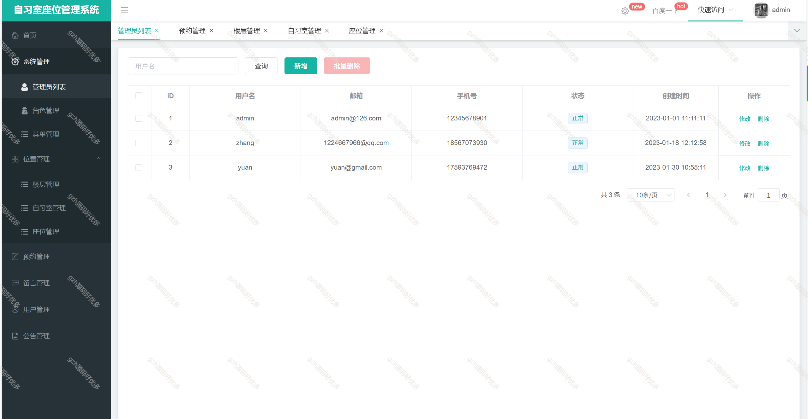
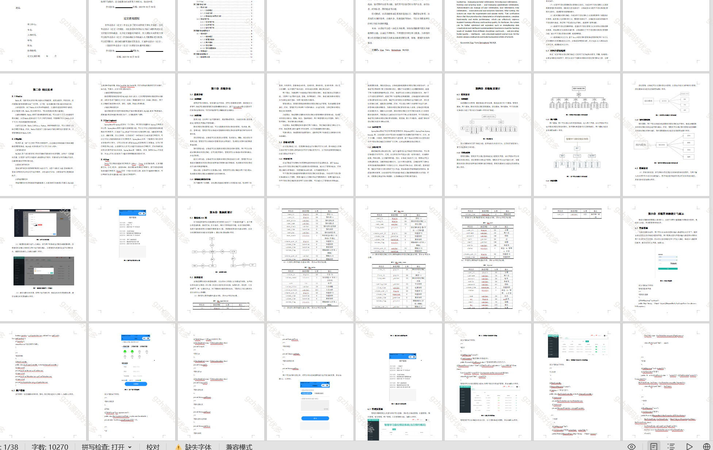
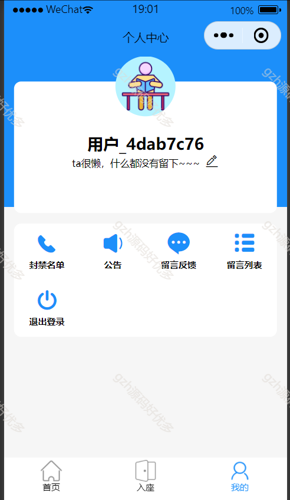
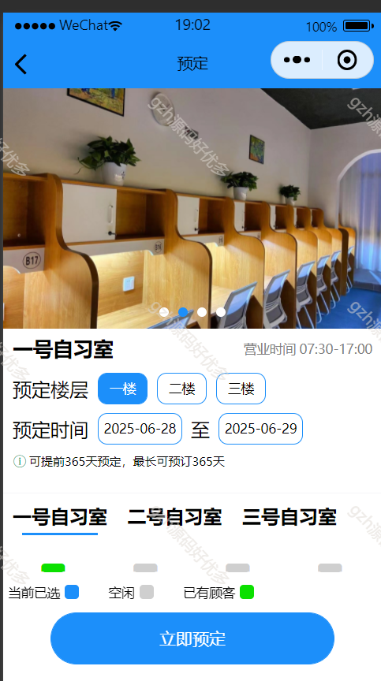
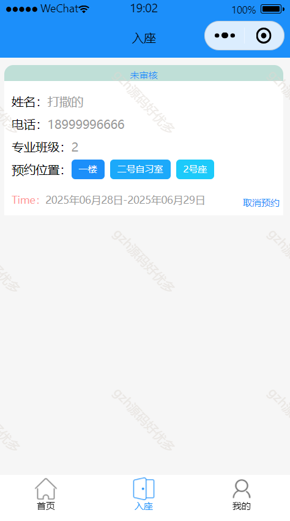
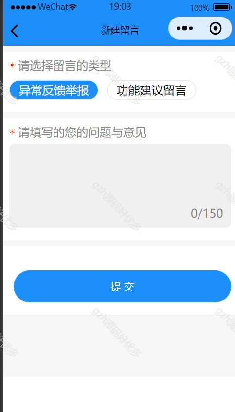

# mpweixinA080
mpweixinA080自习室座位预约微信小程序
 
## 查看主页获取源码

### 一、关键词

自习室预约，自习室座位预约

 

### 二、作品包含

源码+数据库+万字文档+全套环境和工具资源+部署教程

 

### 三、项目技术

前端技术： vue2 Element-ui   Axios 
后端技术：Java、SpringBoot2.0、MyBatis

  

 

### 四、运行环境（以下版本亲测，其他版本未知，请自测）

开发工具：IDEA/eclipse  + VSCODE + 微信开发者工具+HBuilder X

数据库：MySQL8

数据库管理工具：Navicat10以上版本

环境配置软件： JDK1.8 + Maven3.6.3

前端Nodejs：12

浏览器：谷歌浏览器

 

### 五、项目介绍

项目编号：mpweixinA080

该系统通过借助互联网，实现了座位预定、空间管理、数据分析等多种功能，为学生提供了便捷、高效、智能的学习环境。
系统分为学生和管理员两个角色。学生可以进行登录注册、管理个人信息、浏览座位信息、预约选座、管理预约信息等功能。管理员可以管理所有用户信息、座位信息、时刻信息、预约选座等功能。

 

### 六、运行截图

